<!-- Собрано командой `npm run report:mvp`. Не редактируйте этот файл:
     текст — docs/reports/src/mvp-report.ru.md, снимки — tests/e2e/mvp/steps.ts. -->

# MVP: что сделано и как этим пользоваться

Отчёт по первому этапу — рабочий прототип системы управления гостиницей.
Написан для заказчика и для сотрудников стойки: что реализовано из восьми
пунктов задания, на каком экране это находится и как этим пользоваться.

Технические решения — в остальных файлах `docs/guides/`, они на английском и
адресованы разработчикам. Здесь только то, что видно на экране.

**Где это открывается.** Рабочее место администратора:

```
/desk/<организация>/<объект>
```

Слева — шесть разделов. Между ними администратор ходит весь день, поэтому
они всегда на виду и никогда не сворачиваются в полоску иконок.

| Раздел           | Что это                                                     |
| ---------------- | ----------------------------------------------------------- |
| **Шахматка**     | календарь занятости: номера сверху вниз, даты слева направо |
| **Актуальные**   | заезды, выезды и проживающие на выбранный день              |
| **Бронирования** | все брони, поиск без знания дат                             |
| **Номера**       | категории и номера, и что с каждым сегодня                  |
| **Уборка**       | состояние этажа: что убрано, что нет, что в работе          |
| **Гости**        | справочник, карточка гостя, история проживаний              |

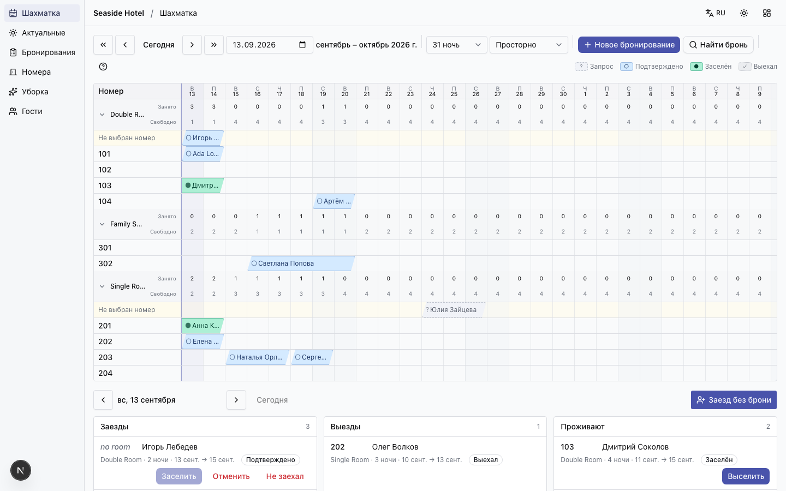

_Шахматка: номера сверху вниз, даты слева направо, бронь — одна полоса._

---

## Восемь пунктов задания

### 1. Шахматка — календарь занятости номеров

Раздел **Шахматка**. Номера сгруппированы по категориям, даты — по горизонтали.

Бронь нарисована **полосой на всю длину проживания**, а не набором отдельных
ячеек: проживание — это одно целое, и видно его одним взглядом.

Над каждой категорией — две строки чисел на каждую ночь: **Занято** и
**Свободно**. Вопрос «возьму ли я ещё одного гостя в пятницу» решается без
подсчёта: он написан на экране.

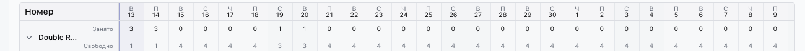

_Занято и свободно на каждую ночь, по категориям — а не одним числом на гостиницу._

Отдельная полоса **«Не выбран номер»** — брони, которым номер ещё не назначен.
Это нормальная ситуация: гость покупает _категорию_, а не конкретную дверь.
Перетащите полосу на строку номера — номер назначен.


_«Не выбран номер»: гость купил категорию. Полосу перетаскивают на строку номера._

### 2. Создание и отображение номеров

Раздел **Номера**. Сверху категории (например «Двухместный», «Люкс»), снизу
сами номера.

Кнопки **«Добавить»** создают и то и другое. Номера сортируются так, как идут по
коридору: 2 перед 10, а не наоборот.

**Количество номеров нигде не вводится вручную** — система считает их сама по
созданным номерам. Добавили номер — он продаётся в тот же момент, на любую дату,
без «открытия периода продаж».

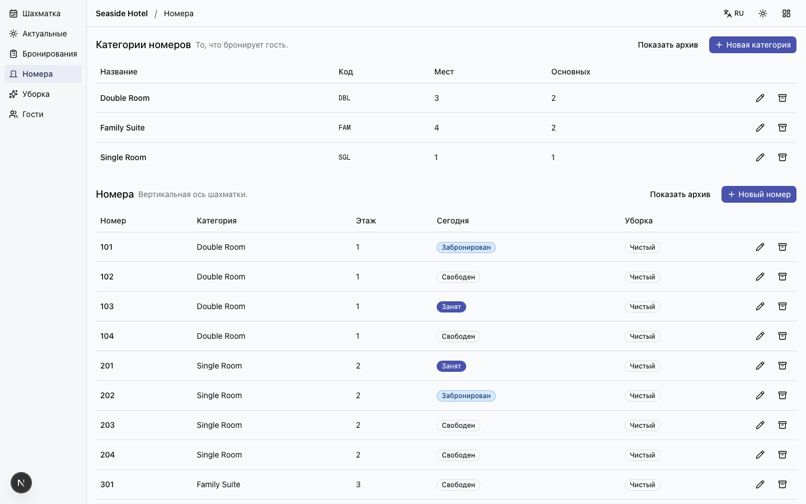

_Номера: категории, номера, и два разных вопроса — «Сегодня» и «Уборка»._

### 3. Бронирование номера

Кнопка **«Новое бронирование»** в шахматке.

В форме видно, **сколько номеров каждой категории свободно на каждую ночь** —
не одно число на весь период, а по ночам. Стоимость складывается из ночей:
пятница и суббота дороже, и это видно.

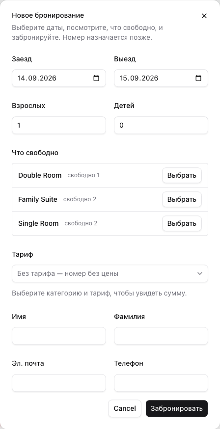

_Новое бронирование: свободные номера показаны по ночам, стоимость складывается из них._

Отдельно кнопка **«Заезд без брони»** — гость пришёл без брони: система создаёт
бронь, назначает номер и заселяет одним действием.

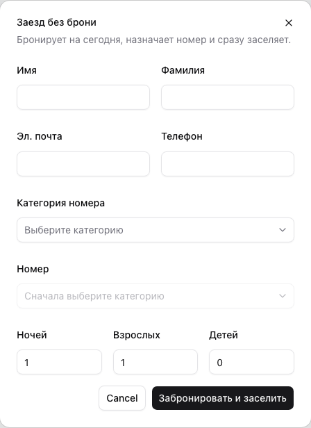

_Заезд без брони: бронь, номер и заселение одним действием._

### 4. Статус номера: свободен, забронирован, занят

Раздел **Номера**, столбец **«Сегодня»** — на снимке выше:

|                  |                                               |
| ---------------- | --------------------------------------------- |
| **Свободен**     | на сегодня никто не заселён и не забронирован |
| **Забронирован** | бронь на сегодня есть, гость ещё не заселился |
| **Занят**        | гость в номере                                |

Рядом — столбец **«Уборка»**: чисто, грязно, убирается, проверен, не в продаже.

**Это два разных вопроса об одном номере**, и они не совпадают. Номер бывает
чистым и проданным, и грязным и свободным. Экран, показывающий только одно из
двух, отвечает не на тот вопрос.

Ни то ни другое не хранится как «поле, которое кто-то проставил»: занятость
считается по проживаниям, чистота — по работам уборки. Поле, которое надо не
забыть обновить, устаревает в тот день, когда о нём забыли.

### 5. Карточка бронирования

Щелчок по полосе в шахматке → **«Открыть»**. Карточка открывается **не выходя
из рабочего места**.

Две вкладки:

- **Основное** — статус и доступные действия, даты, категория, тариф, номер,
  гости, примечания, суммы.
- **Оплата** — счёт: начисления, оплаты, остаток, закрытие счёта.

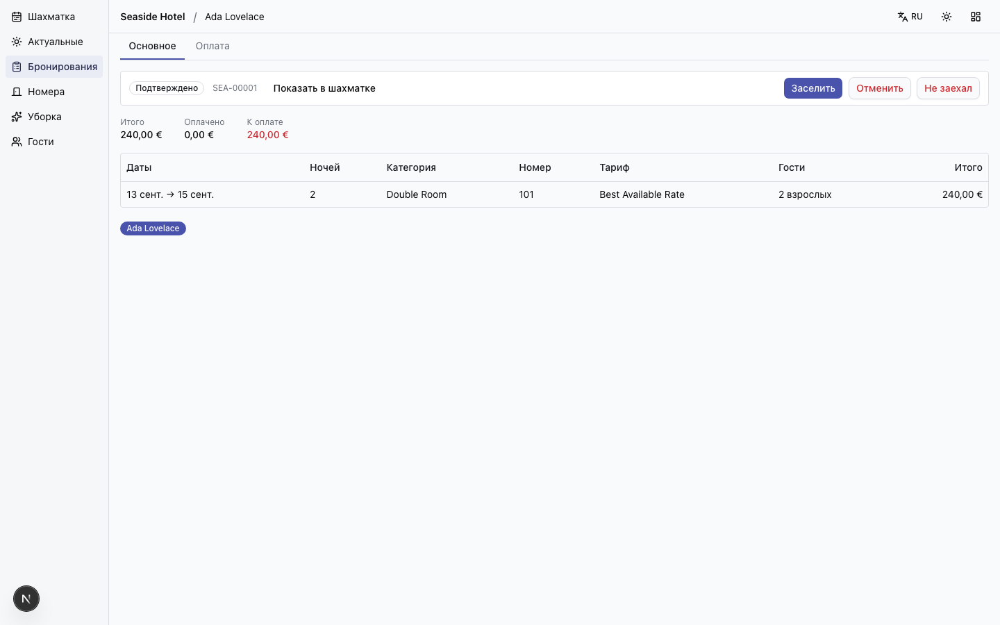

_Карточка бронирования, вкладка «Основное» — статус, даты, гости, суммы._

**Вкладки — это адреса.** Ссылку на счёт можно отправить коллеге, и он откроет
именно счёт. Адрес брони содержит нечитаемый идентификатор, а не порядковый
номер: иначе по ссылке видно, сколько броней приняла гостиница.

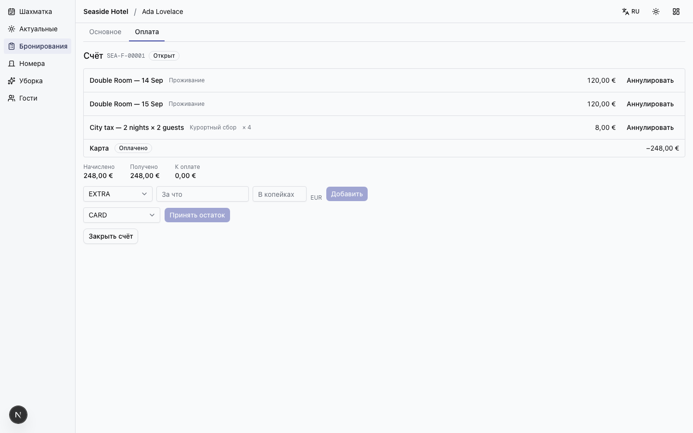

_Вкладка «Оплата»: начисления, оплаты, остаток. Вкладки — это адреса._

Действия (Заселить, Выселить, Отменить, Не заехал) **всегда объясняют отказ**.
Если кнопка недоступна — наведите на неё: написано, почему. Заселить до дня
заезда нельзя, и система говорит об этом словами, а не молчанием.


_«Заселить» недоступно до дня заезда — и причина написана рядом, словами, а не оставлена на догадку._

### 6. Базовая карточка гостя

Раздел **Гости** → щелчок по имени.

Контакты, теги (VIP, проблемный — словарь гостиницы), примечания, документы
(паспорт, согласия, прочие файлы) и **история проживаний**. Каждое проживание
открывается по щелчку.

История — это и есть смысл справочника: вернувшийся гость должен быть _одним
человеком с историей_, а не тремя не связанными бронями.

Справочник общий на всю организацию: гость одной гостиницы сети — гость сети.

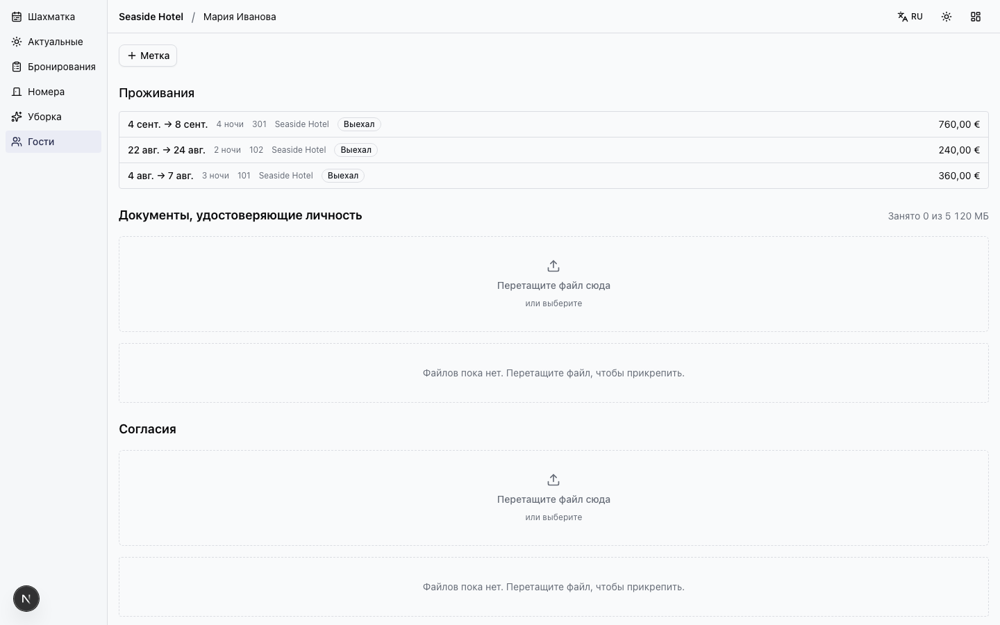

_Карточка гостя: контакты, теги, документы и история проживаний._

### 7. Отображение заезда и выезда в шахматке

Показано двумя способами, и они дополняют друг друга.

**В самой шахматке.** Начало полосы — заезд, конец — выезд. Когда в один день
один гость выезжает, а другой заезжает, ячейка **делится по диагонали**: номер
в этот день не свободен, но и не продан дважды. Это обычная ситуация загруженной
гостиницы, и большинство систем её нарисовать не умеют.

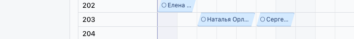

_Один выезжает, другой заезжает в тот же день: ячейка делится по диагонали._

**Списками — на том же экране.** Три колонки: **Заезды**, **Выезды**,
**Проживают**, с кнопками действий. На широком мониторе они стоят рядом с
шахматкой, на ноутбуке — под ней. Администратора весь день
спрашивают именно об этом, поэтому списки не спрятаны в отдельный раздел.

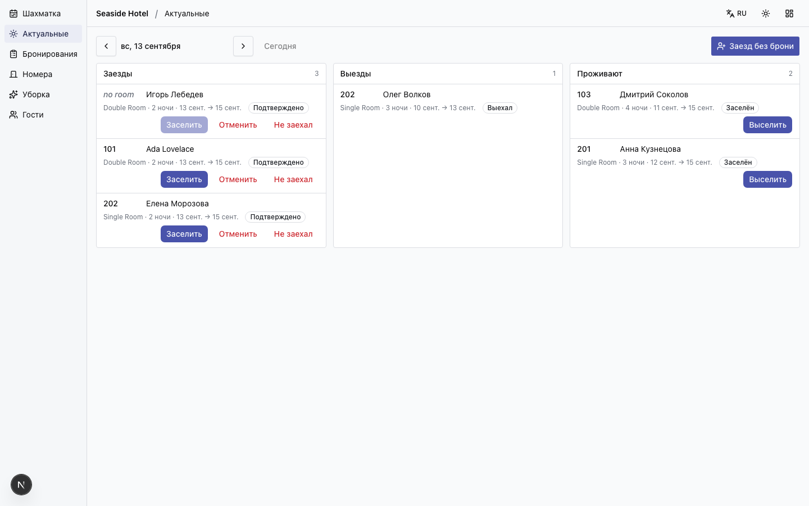

_Актуальные: заезды, выезды и проживающие на выбранный день._

### 8. Базовая навигация по датам

Панель над шахматкой:

- **← →** — день вперёд и назад, **« »** — неделя;
- **«Сегодня»** — вернуться;
- поле даты — перейти к любому дню;
- **14 / 31 / 62** — сколько ночей показывать;
- **плотность** — насколько плотно; выбор запоминается.

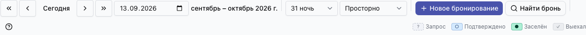

_Навигация по датам: день, неделя, любая дата, длина окна и плотность._

Показывается **окно от выбранной даты**, а не календарный месяц. Это сделано
намеренно: проживание с 29 марта по 2 апреля в месячной сетке разрезается
пополам, а здесь видно целиком.

---

## Что ещё есть сверх задания

Не заказывалось на первом этапе, но уже работает и может быть показано:

- **Уборка.** Выселение автоматически делает номер грязным и ставит задачу на
  уборку. Никто не вводит это руками.
- **Счёт.** Открывается самим выселением, а не кнопкой. Закрыть счёт можно,
  только когда он сходится в ноль.
- **Два языка** — русский и английский, переключение в верхней панели.
- **Оформление** — светлое, тёмное и «высокий контраст» для яркого холла.
  Выбор запоминается.

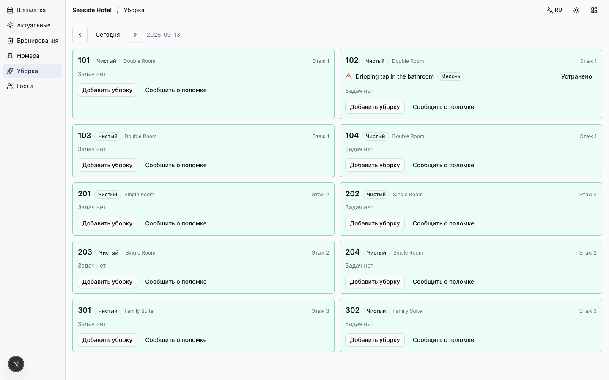

_Уборка: состояние этажа. Выселение само делает номер грязным._

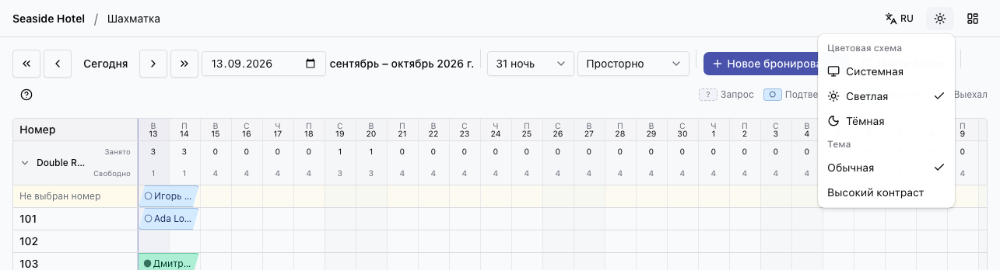

_Язык и оформление в верхней панели: светлая, тёмная, высокий контраст._

## Чего пока нет

Честный список, чтобы не возникло ожиданий:

- **Каналы продаж** (Booking.com и подобные) — механика готова и покрыта
  тестами, но **ни один канал не подключён**. Правильная формулировка:
  «система готова к подключению», а не «подключена».
- **Фискальные чеки, электронные замки, страница онлайн-бронирования** —
  спроектированы, не реализованы.
- **История изменений брони** — намеренно не показывается: пока нечего
  показывать, и пустая вкладка хуже отсутствующей.
- **Койко-места** (кровать внутри номера) и **почасовые объекты** (баня, сауна)
  — требуют решения заказчика до реализации. Оба меняют основание системы, и
  оба дешевле обсудить сейчас, чем переделывать потом.

---

## Как посмотреть

```bash
docker compose -f docker/compose/db.yml up -d
npm run db:seed     # учётные записи, организация и объект
npm run demo        # гостиница с данными
npm run dev
```

Вход: `admin@konak.dev` / `konak-demo-pw`, далее
`http://localhost:3000/desk/acme/seaside`.

Пароль у всех учётных записей одинаковый — это демонстрационные данные, и в
рабочей установке сид не запускается.

| Адрес             | Имя          | Права     |
| ----------------- | ------------ | --------- |
| `admin@konak.dev` | Ada Admin    | ADMIN     |
| `mod@konak.dev`   | Mo Moderator | MODERATOR |
| `user@konak.dev`  | Uma User     | USER      |

Демонстрационная гостиница: 10 номеров в 3 категориях, 19 броней во всех состояниях — включая отмену, незаезд и две смены гостя в один день. Есть гостья с тремя прошлыми проживаниями.

`npm run demo` можно запускать повторно: он убирает данные прошлого запуска,
поэтому репетиция ничего не портит.

Сценарий показа по шагам — [demo.md](../guides/demo.md).

---

Снимки экрана сделаны автоматически в реальном приложении 2026-09-13 (сборка `1742e73`), 15 шт. Даты в демонстрационных данных отсчитываются от дня запуска, поэтому в следующем отчёте они будут другими.
